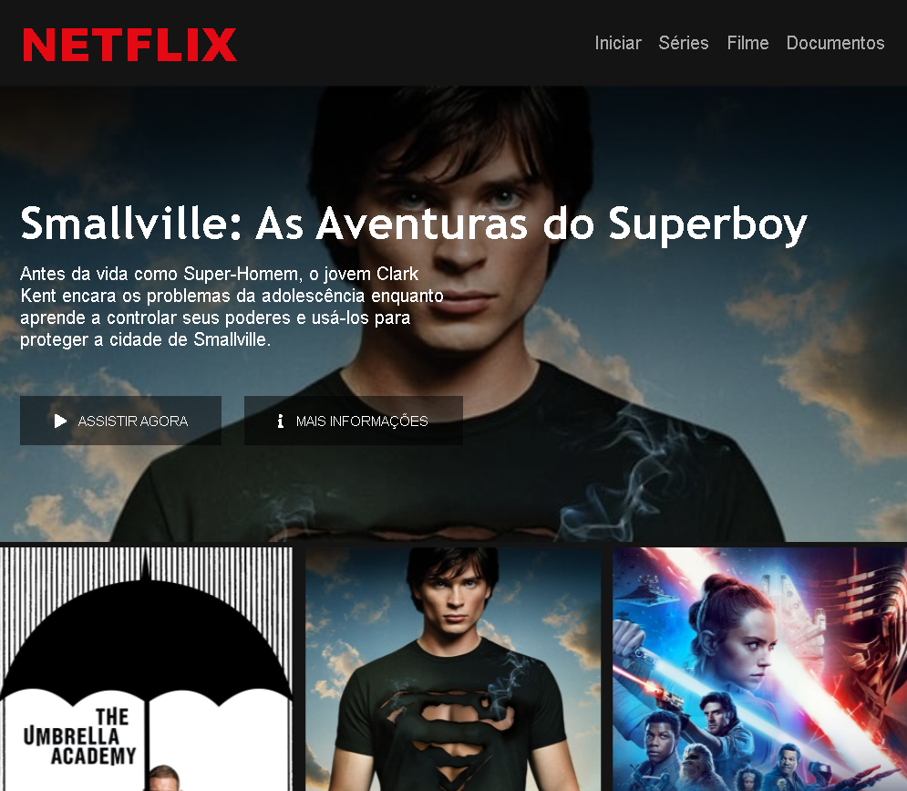

  

<h2 align="center">Tópicos 📋</h2>

   

   
   - [Sobre 📖](#sobre-)
   - [Layout 🎨](#layout-)
   - [Autor 🎓](#autor)

   

---

<h2 align="center">Sobre 📖</h2>
   

   O projeto Netflix Clone foi desenvolvido com o conteúdo ofertado na DIO, durante o Bootcamp Inter Frontend Developer

---

<h2 align="center">Layout 🎨</h2>

   

      
   

<h3 id="autor" align="center"> Autor </h3>

<a href="https://github.com/valdir-alves3000/">
 
  
 <b>Valdir Alves </b>🚀</a>

Feito com ❤️ por Valdir Alves. Entre em contato!

